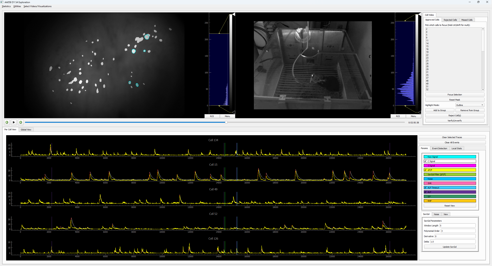

# Calcium Transient Analysis Toolbox

This toolbox offers a variety of functionality to meet various post-CNMF analysis of Calcium Imaging Data including:

- **CalTrig** - A single window solution to visualize all data stream outputs from the CNMF process, to assist in the verification of neuronal footprints and transients as well as utilities to identify transients (manual/automatic/machine learning). Preprint link - [CalTrig: A GUI-Based Machine Learning Approach for Decoding Neuronal Calcium Transients in Freely Moving Rodents](https://www.biorxiv.org/content/10.1101/2024.09.30.615860v1)
- **Clustering Tool** - Visualization of clustering done by comparing the Discrete Fourier Transform of Calcium dynamics of observed cells. Paper link - [Visual Analytics and Exploration of Calcium Transient Imaging Data using Event-Based Clustering](https://ieeexplore.ieee.org/abstract/document/10386744)

We are also working on a few more exciting extensions to this toolbox! They are currently a _work in progress_ but they include:
 - **Genetic Algorithm** - Investigating the correct window size around external behavior events (RNF, ILP etc...) using a genetic algorithm to identify differences in calcium signal dynamics between salium and cocaine mice groups.

 - **3D CalTrig Extension** - We are expanding CalTrig by utilizing mayavi for 3D visualization, allowing the user to select and isolate specific signals.

The Toolbox has so far been used by our team for research and we've tested the GUI on Windows and [MATE](https://mate-desktop.org/), we encourage the usage of our toolbox but we haven't tested it in other environments. For help or bug reporting please report any problems to the Issues page in this repository.

## Documentation

https://calcium-transient-analysis.readthedocs.io/en/latest/

## Create Environment

To install, clone the repository and run the following command:

`conda env create -f environment_ml.yml`

For machine learning purposes we use pytorch. We are aware of the relatively large install requirement for this package and that not all users require the machine learning parts of the GUI, hence we've also
included a basic yml file that omits ml.

`conda env create -f environment_basic.yml`

## Brief Point About Inputs

This Toolbox was built for the purpose of processing output from [Minian](https://github.com/denisecailab/minian), with a few minor changes as well. The tool should also be compatible with any CNMF output from other Tools such as [Caiman](https://github.com/flatironinstitute/CaImAn), however they will need to be translated to the proper dimensionality and format (like Minian we use xarrays), for a more detailed overview of the data types used please refer to the documentation [Link](https://calcium-transient-analysis.readthedocs.io/en/latest/Before_you_start.html).
