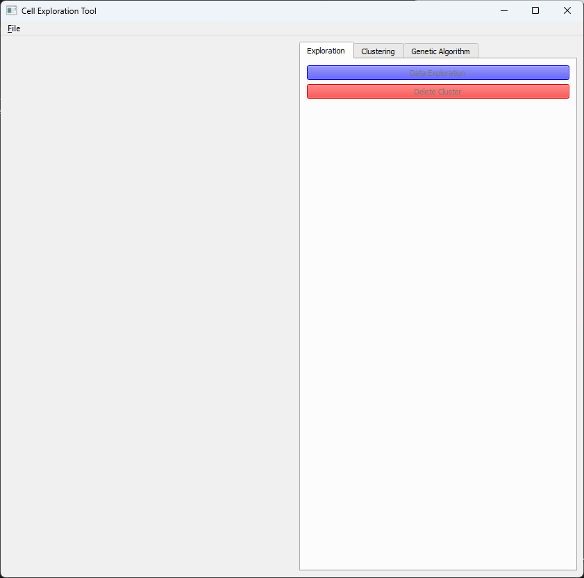
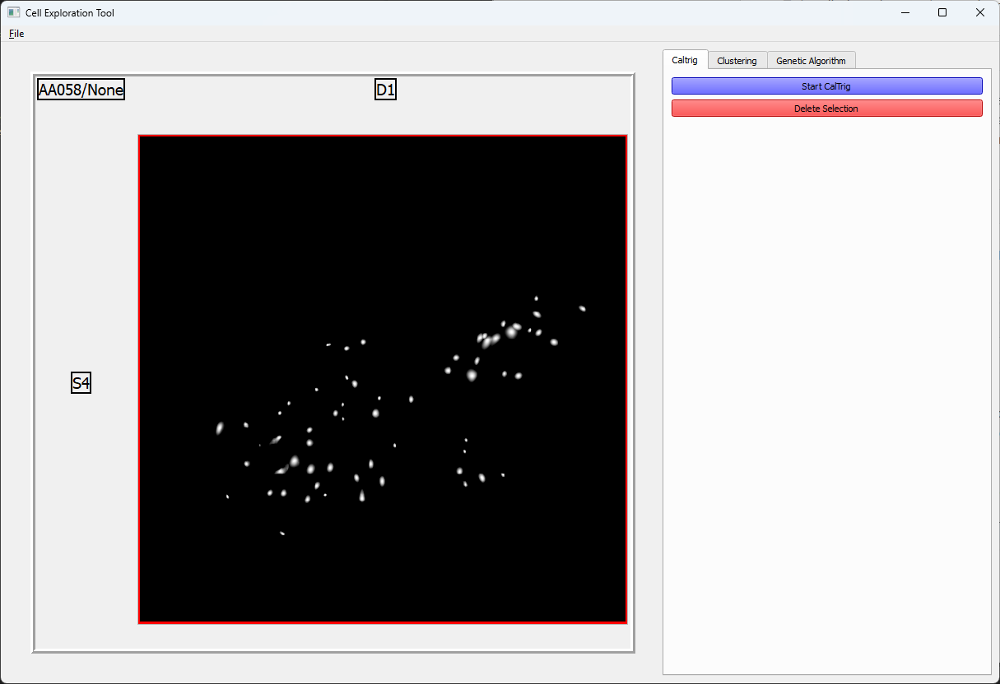
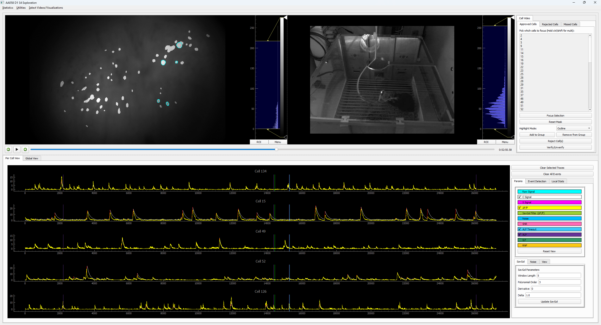
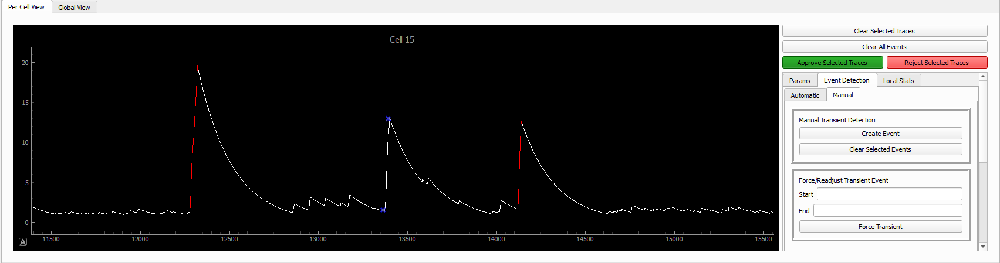

Overview
========

.. _installation:

Installation
------------

To install, clone the repository and run the following command:

.. code-block:: bash

    conda env create -f environment.yml

For machine learning purposes we use pytorch. We are aware
of the relatively large install requirement for this package
and that not all users require the machine learning parts of 
the GUI, hence we've also included a basic yml file that omits ml. 

.. code-block:: bash

    conda env create -f environment_basic.yml

We also provide an equivalent pip requirements file for
those who prefer to use pip:

.. code-block:: bash

    pip install -r requirements_basic.txt

.. _how to use:

Main Window
-----------

Before you use the GUI ensure that your data is set up
correctly in their corresponding folders and that the 
config file points to the correct directories. Please 
refer to :ref:`before_you_start:creating the config file`
and :ref:`before_you_start:video files` for more information.

Once the GUI is loaded you should see the following window:

     
~~~~~~
  

To load in a specific dataset, click *File* -> *Load Data*. You can 
also load in other datasets as well and their corresponding
max projection of cell footprints will be visualized. If you wish 
to save the currently loaded setup of datasets, click *File* -> *Save*,
this will create a json file that will point to all loaded config.ini files.

CalTrig
-------

In order to use the CalTrig utility, select a given dataset from the main 
window view, switch to the CalTrig tab and click *Start CalTrig*. 

~~~~~~

This will open a new window for the specified dataset that will look like this:

~~~~~~

For the time being let's focus on the upper half part of the window.
The upper section is primarily occupied by the visualization of the video,
with tools underneath for playing and scrolling the video. You can move
the video view by clicking and dragging your mouse, you can also zoom
in on any part of the video with the scroll wheel. You can also
switch between different video types by right-clicking on the video
and selecting *Video Format*.

To the right of the video you have a series of tabs with differing
functionality:

+ *Approved Cells* - Initially all cells are considered approved and
  it is up to the user to verify or reject them. Select any number of
  cells from the list (use ctrl to select multiple or ctrl+a to select all)
  and click on *Focus Selection* to see the Selection visualized on the video.
  You can revert back to the original state by pressing *Reset Mask*.
  Once cells have been selected you can click on them to have their 
  corresponding traces visualized on the lower half of the window. 

In case you want to remove the blue color from the video, press the
*Clear Color* button to toggle the state.  The *Verify/Unverify* button 
highlights the cell in green to indicate it has been already checked and
verified. If you notice any issue with an observed cell, press the 
*Reject Cell* button.

+ *Rejected Cells* - All cells that have been rejected will appear as a
  list in this tab. If a rejection was made erroneously you can return it
  by selecting the cell and pressing the *Return Cell* button.

+ *Missed Cells* - The missed cell section provides the ability to the
  user to highlight any cell that could have been missed by the 
  preprocessing software. Before selecting *Enable Select Cell Mode*
  make sure the field of view in the video section is zoomed in on 
  the section where you have detected a missing cell. In *Enable 
  Select Cell Mode* the field of view will be frozen, allowing the
  user to trace out the outlines of a cell by holding down the
  left-mouse button. If the outline is completed and the drawn trace
  is closed, the inner part of the trace will be filled as well.
  A right-mouse click and drag will remove any selected pixels. 
  Once completed press *Confirm Selected Pixels* to add the selection
  to the *Missed Cells* list. The selection of the missed cell will
  generate a signal based on the sum of the pixel values across time
  using the raw signal from the processed video array.

Between the lower and upper half of the window there is a divider 
which can be dragged to adjust the size of the respective halves.

Once a signal is selected it's corresponding trace can be seen
in the bottom half of the window. This plot is similarly interactable
like the window in the upper half (zoom dragging etc...), the axis can
also be zoomed with respect to the x and y axis by holding down the
right mouse button and dragging. To the right of it is a set of
utility to aid you in the process of observing and transient event 
identification. The first box indicates the various signals from the
corresponding cell that can be visualized.

The next is a set of parameters that can be set to perform an automatic
detection of events within selected cells.

The final box of buttons *Manual Transient Detection* refers to utility
to manually add or remove transient events from a given cell. 
A confirmed event will show up as a red segment on the visualized C signal.
The removal of a confirmed event can be done by selecting the red segment,
which will switch the color from red to blue. Subsequently to confirm its 
removal, press the *Clear Selected Events* button.

~~~~~~

For event creation, double click on the plot in two spots indicating
the start and the end of a transient event. Then click *Create Event*.
