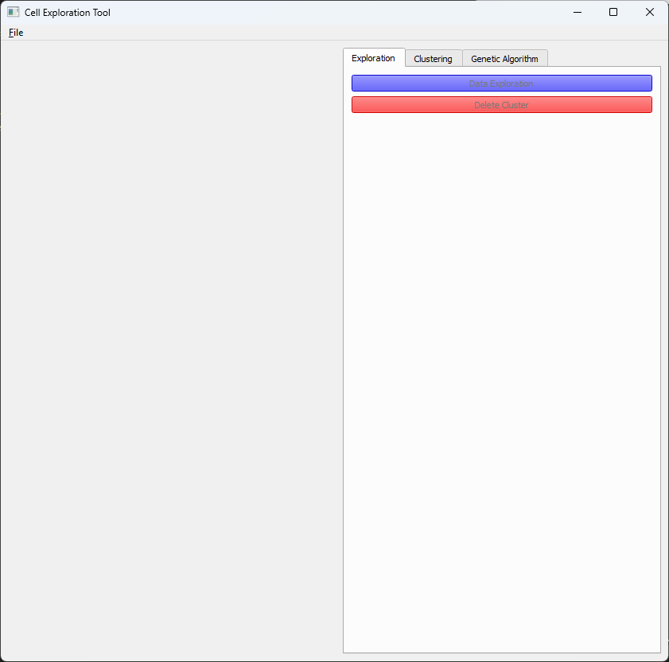
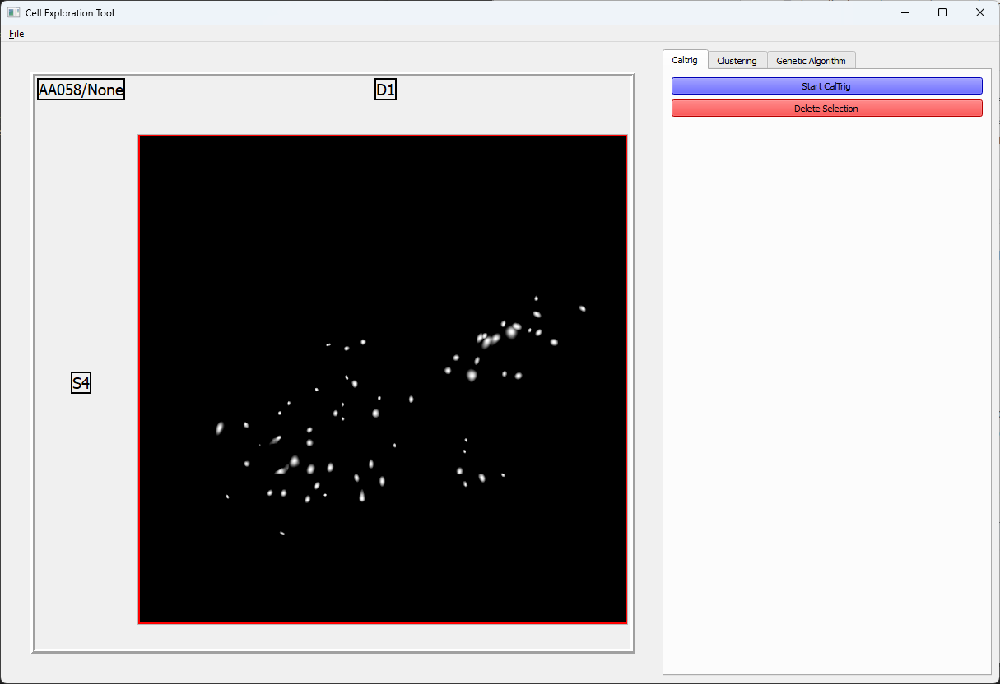
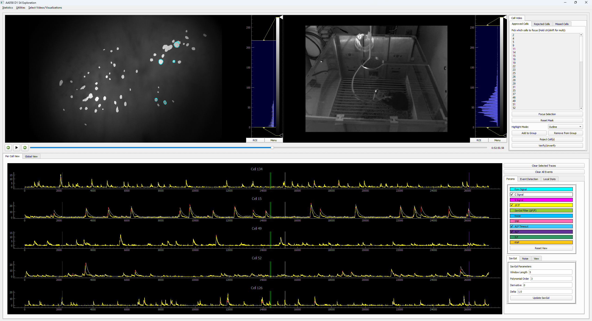
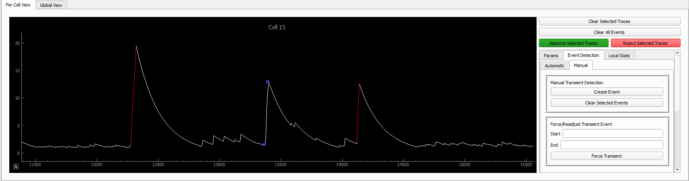
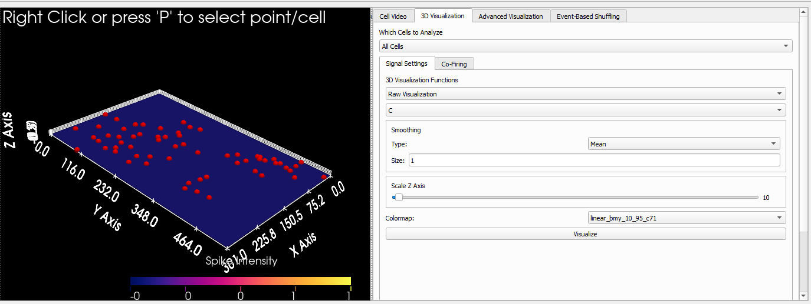
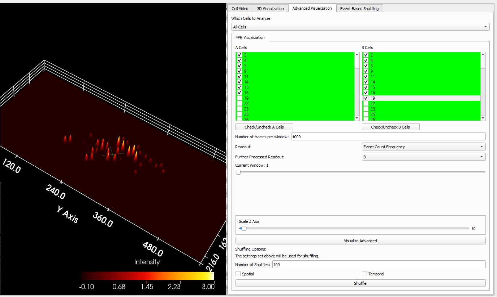
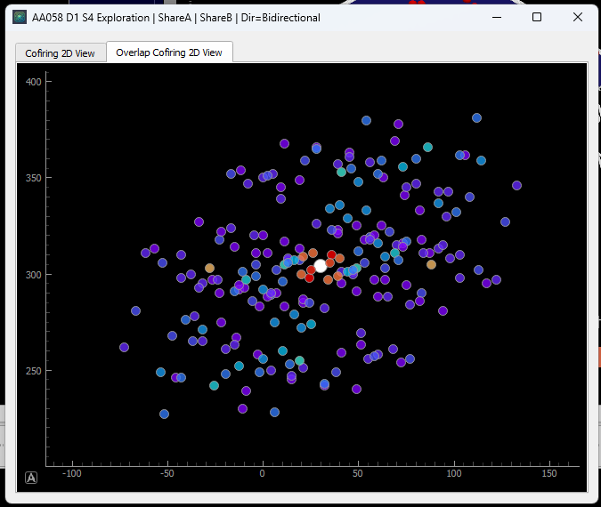
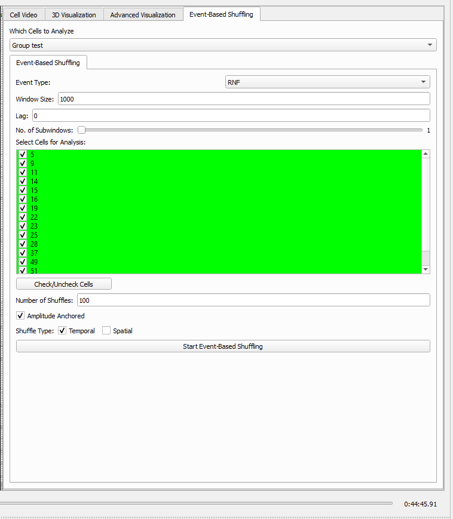
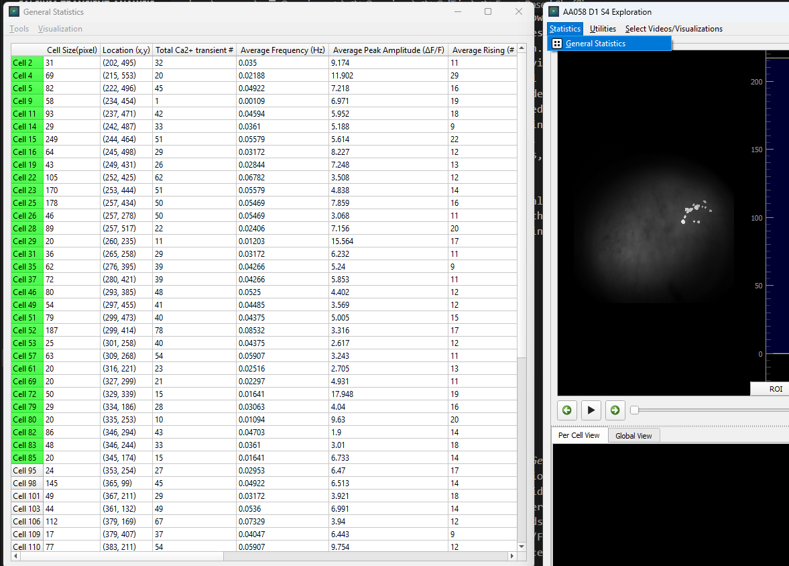
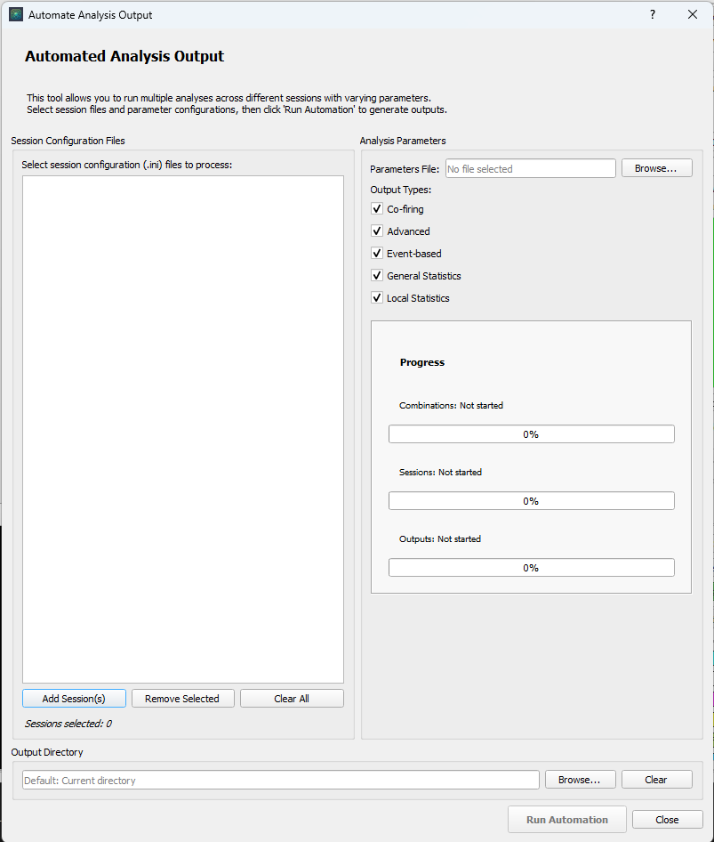

Overview
========

.. _installation:

Installation
------------

**Prerequisites:**

Before you begin, ensure that `Conda <https://docs.conda.io/en/latest/>`_ is installed on your system. You can download and install either `Anaconda <https://www.anaconda.com/download/success>`_ or the lighter `Miniconda <https://www.anaconda.com/docs/getting-started/miniconda/install>`_ distribution.

**Step 1: Clone the Repository**

Clone the repository to your local machine:

.. code-block:: bash
    
    git clone https://github.com/cci-MaLab/Calcium-Transient-Analysis.git
    cd Calcium-Transient-Analysis
    

**Step 2: Create the Conda Environment**

For full functionality including machine learning support with PyTorch, create the environment using the provided YAML file:

.. code-block:: bash

    conda env create -f environment_ml.yml

If you do not require the machine learning parts of the GUI (which include PyTorch and have larger install requirements), you can create a lighter environment instead:

.. code-block:: bash

    conda env create -f environment_basic.yml

.. note:: The environment name is specified in the YAML file under the `name:` field. It will be set to `cell_exploration_ml` or `cell_exploration` depending on which aformentioned `.yml` file was picked. We will assume here that `environment_ml.yml` was used for the rest of the guide.

**Step 3: Activate the Environment**

After creating the environment, activate it with:

.. code-block:: bash

    conda activate cell_exploration_ml

**Step 4: Run the Application**

With the environment activated, run the main application by executing:

.. code-block:: bash

    python main.py

On subsequent runs, you will only need to activate the environment and run the application, a.k.a. steps 3 and 4.

**Alternative: Using pip**

If you prefer pip over conda, we provide a requirements file for a basic installation:

.. code-block:: bash

    pip install -r requirements_basic.txt

.. _demo data:

Demo Data
---------

You can test the GUI out with demo data provided at this `link <https://drive.google.com/drive/folders/143QBRTsuf5SMr1bU-a6rqJvcvzux7Z9r>`_.

.. _how to use:

Main Window
-----------

Before you use the GUI ensure that your data is set up
correctly in their corresponding folders and that the 
config file points to the correct directories. Please 
refer to :ref:`before_you_start:creating the config file`
and :ref:`before_you_start:video files` for more information.

Once the GUI is loaded you should see the following window:

     
~~~~~~
  

To load in a specific dataset, click *File* -> *Load Data* then proceed to
select the config file you have created in :ref:`before_you_start:creating the config file`.
You can also load in other datasets as well and their corresponding
max projection of cell footprints will be visualized. If you wish 
to save the currently loaded setup of datasets, click *File* -> *Save*,
this will create a json file that will point to all loaded config.ini files.
To load in a saved setup, click *File* -> *Load Saved State*. Below is an
example of what a generated json file could look like:

.. code-block:: json

    {
        "C:/Users/Michal Lange/Documents/Calcium-Transient-Analysis/config_files/configA58S4.ini": null,
        "C:/Users/Michal Lange/Documents/Calcium-Transient-Analysis/config_files/configA34D1S1.ini": null,
        "defaults": {
            "ALP": {
                "window": 20,
                "delay": 0
            },
            "ILP": {
                "window": 20,
                "delay": 0
            },
            "RNF": {
                "window": 20,
                "delay": 0
            },
            "ALP_Timeout": {
                "window": 20,
                "delay": 0
            },
            "distance_metric": "euclidean"
        }
    }

The defaults and distance_metric parts can be ignored as they are utilized for the cell clustering
part of the GUI and is not part of CalTrig. File paths can be added or removed
as needed from the json file, however it is recommended to use the GUI to save and load the state to
avoid any issues.

CalTrig
-------

In order to use the CalTrig utility, select a given dataset from the main 
window view, switch to the CalTrig tab and click *Start CalTrig*. 

~~~~~~

This will open a new window for the specified dataset that will look like this:

~~~~~~

For the time being let's focus on the upper half part of the window.
The upper section is primarily occupied by the visualization of the video,
with tools underneath for playing and scrolling the video. You can move
the video view by clicking and dragging your mouse, you can also zoom
in on any part of the video with the scroll wheel. You can also
switch between different video types by right-clicking on the video
and selecting *Video Format*.

To the right of the video you have a series of tabs with differing
functionality:

+ *Approved Cells* - Initially all cells are considered approved and
  it is up to the user to verify or reject them. Select any number of
  cells from the list (use ctrl to select multiple or ctrl+a to select all)
  and click on *Focus Selection* to see the selection visualized on the video,
  or click *Focus and Trace* to simultaneously visualize the selection and
  immediately plot the corresponding traces in the lower half of the window.
  You can revert back to the original state by pressing *Reset Mask*.
  Once cells have been selected you can click on them individually to have
  their corresponding traces visualized on the lower half of the window.

  The *Highlight Mode* dropdown controls how selected cells are drawn on
  the video: *Outline* draws a border around each cell footprint, *Color*
  fills the footprint, and *Clear* removes all highlighting without
  resetting the selection.

  The *Verify/Unverify* button highlights the cell in green to indicate it
  has already been checked. If you notice any issue with an observed cell,
  press *Reject Cell(s)* to move it to the rejected list.

  Cells can also be organised into named groups. Select one or more cells
  and press *Add to Group* or *Remove from Group* to manage group membership.
  Alternatively, right-click on the video and choose *Add Group* →
  *Rectangle* or *Add Group* → *Ellipse* to draw a spatial ROI directly on
  the video; all cell footprints that fall within the drawn shape will be
  added to a new group automatically.

+ *Rejected Cells* - All cells that have been rejected will appear as a
  list in this tab. If a rejection was made erroneously you can return it
  by selecting the cell and pressing the *Return Cell* button. Selecting a
  cell and pressing *Show/Justify Rejection* opens a free-text field where
  a written justification for the rejection can be entered or reviewed;
  press *Save* to store the note or *Cancel* to dismiss without saving.

+ *Missed Cells* - The missed cell section provides the ability to the
  user to highlight any cell that could have been missed by the 
  preprocessing software. Before selecting *Enable Select Cell Mode*
  make sure the field of view in the video section is zoomed in on 
  the section where you have detected a missing cell. In *Enable 
  Select Cell Mode* the field of view will be frozen, allowing the
  user to trace out the outlines of a cell by holding down the
  left-mouse button. If the outline is completed and the drawn trace
  is closed, the inner part of the trace will be filled as well.
  A right-mouse click and drag will remove any selected pixels. 
  Once completed press *Confirm Selected Pixels* to add the selection
  to the *Missed Cells* list. The selection of the missed cell will
  generate a signal based on the sum of the pixel values across time
  using the raw signal from the processed video array.

Between the lower and upper half of the window there is a divider 
which can be dragged to adjust the size of the respective halves.

Once a signal is selected its corresponding trace can be seen in the
bottom half of the window. This plot is similarly interactable like the
video in the upper half (click-and-drag to pan, scroll to zoom); the
axes can also be zoomed independently by holding down the right mouse
button and dragging. To the right of the trace is a panel with three
tabs:

**Params**

Contains four sub-tabs for adjusting how the signal is displayed and
analysed:

- *SavGol* — applies a Savitzky-Golay smoothing filter to the ΔF/F
  signal. Set *Window Length*, *Polynomial Order*, *Derivative*, and
  *Delta*, then press *Update SavGol* to redraw the trace.

- *Noise* — overlays a rolling noise baseline on the trace. Choose a
  *Window Length*, a *Type* (None / Mean / Median / Max), and a *Cap*
  value, then press *Update Noise*.

- *View* — controls the visible range of the trace plot. Set *Y Axis
  Start* and *Y Axis End* to fix the vertical range, and *Window Size*
  to limit how many frames are shown at once. Enable *Single Plot View*
  to stack all selected cells' traces with configurable *Inter Cell
  Distance* and *Intra Cell Distance* spacing. Press *Update View* to
  apply.

- *Window Size Preview* — draws a preview window on the trace before
  committing to a window size for analysis. Set a *Window Size*, divide
  it into subwindows using the *No. of Subwindows* slider, and adjust
  a *Lag* offset. Tick *Preview* to overlay it live on the trace, or
  tick *Event Window* and select an event type (RNF / ALP / ILP /
  ALP_Timeout) from the dropdown to align the preview to that event.
  Press *Update Size* to set the window.

Above the sub-tabs is a set of signal checkboxes that toggle which
trace types are overlaid on the plot: *C Signal* (white), *S Signal*
(magenta), *Raw Signal* (cyan), *ΔF/F* (yellow), *SavGol Filter
(ΔF/F)* (yellow-green), *Noise* (light blue), and *SNR* (pink).
Behavioural event markers (RNF, ALP, ILP, ALP_Timeout) are also
available as overlays when present in the loaded dataset.

**Event Detection**

Contains up to three sub-tabs for creating and reviewing transient
events:

- *Automatic* — set a *Peak Threshold (ΔF/F)*, an *Interval Threshold
  (frames)*, and an *SNR Threshold*, then press *Calculate Events* to
  run peak detection on the selected cell. If a trained model file is
  available, a model selector dropdown and *Run Model* button also
  appear here. Select the desired model, set the *Model Confidence
  Threshold* (default 0.5), and press *Run Model*. The model's
  predicted events appear as temporary picks highlighted on the trace.
  Use *Toggle Temp Picks* to show or hide them and *Show Evaluation
  Metrics* to inspect performance statistics. Choose a confirmation
  mode — *Accept Incoming Only* (only picks that do not overlap with
  existing events), *Accept Overlapping Only* (only picks that coincide
  with existing ones), or *Accept All* — then press *Confirm Temp
  Picks* (green) to finalise or *Clear Temp Picks* (red) to discard.

- *Manual* — provides tools for hand-crafting events. Double-click two
  points on the trace to mark the start and end of a candidate
  transient, then press *Create Event* to confirm it as a red segment.
  To remove an event, click the red segment to turn it blue, then press
  *Clear Selected Events*. The *Force/Readjust Transient Event* tool
  lets you type an exact *Start* and *End* frame and press the active
  button to snap an existing event to those bounds.

- *ML Results* *(only visible when pre-loaded test result files are
  present)* — displays evaluation comparisons between pre-computed ML
  run results and manual annotations. Use the dropdowns to select the
  experiment, testing set, and number of cells, then press *Generate
  ML Results* to produce the comparison.

**Local Stats**

Press *Generate Local Statistics* to produce amplitude and
inter-event interval (IEI) distributions for the currently selected
cell.

~~~~~~

.. _session_settings:

Session Settings
~~~~~~~~~~~~~~~~

Visualization and analysis parameters can be persisted across sessions
without re-entering them each time. From the CalTrig menu bar go to
*Utilities* → *Save Current Session Settings* to export all current
parameters (signal types, window sizes, shuffling settings, and more)
to a JSON file. To restore a previously saved state, go to *Utilities*
→ *Load Session Settings* and select the corresponding file.

.. _3d_visualization:

3D & Advanced Visualization
~~~~~~~~~~~~~~~~~~~~~~~~~~~~

Both 3D views are disabled by default. Enable them from the menu bar
via *Select Videos/Visualizations* → tick *3D Visualization* or
*Advanced 3D Visualization*. Each enabled view appears alongside the
cell video in the upper panel and can be resized using the horizontal
splitter handles between views.

**3D Visualization**

Reached via the *3D Visualization* tab on the right-hand panel, which
contains two sub-tabs:

- *Signal Settings* — renders all selected cells as a 3D surface or
  spike landscape over time. Use the *Which Cells to Analyze* dropdown
  (All Cells / Verified Cells / any named Group) to scope the
  population. Choose a *3D Visualization Function*:

  - *Raw Visualization* — plots the raw signal value (C, DFF, or
    Binary Transient, selected from the data-type dropdown) for each
    cell continuously over time. When *Transient Visualization* is
    chosen additional modifiers appear: *Cumulative*, *Normalize*, and
    *Average* checkboxes change how the transient signal is
    accumulated and scaled.

  A *Smoothing* frame controls a rolling mean that is applied before
  rendering (set *Type* and *Size*). The *Scale Z Axis* slider
  exaggerates the vertical dimension for easier visual inspection.
  A *Colormap* dropdown lets you cycle through all available
  colormaps. Press *Visualize* to render the scene.

- *Co-Firing* — described in the :ref:`cofiring` section below.

~~~~~~

**Advanced Visualization**

Reached via the *Advanced Visualization* tab. It compares two
populations of cells (A and B) across sliding time windows using a
*Further Processed Readout* (FPR). Select a cell population from the
*Which Cells to Analyze* dropdown, then assign cells to the *A Cells*
and *B Cells* lists using the checkboxes (or the *Check/Uncheck*
buttons for bulk selection). Configure:

- *Number of frames per window* — the temporal resolution of each
  window evaluated on the 3D surface.
- *Readout* — the per-window metric computed for each cell:
  *Event Count Frequency*, *Average DFF Peak*, or *Total DFF Peak*.
- *Further Processed Readout* (FPR) — a formula combining the A and B
  readouts into a single value displayed on the surface. Options are
  B, B-A, (B-A)², (B-A)/A, \|(B-A)/A\|, and B/A.
- *Scale Z Axis* — vertical exaggeration slider.

Press *Visualize Advanced* to render. A window slider appears below
letting you step through each time window.

The *Shuffling Options* section below the visualize button lets you
validate results against chance: tick *Spatial*, *Temporal*, or both,
set a *Number of Shuffles*, and press *Shuffle*. A separate slider
appears to step through the shuffled windows for comparison.

~~~~~~

.. _cofiring:

Co-Firing & Shuffling
~~~~~~~~~~~~~~~~~~~~~

The *Co-Firing* sub-tab lives inside the *3D Visualization* tab
alongside *Signal Settings*. It overlays co-firing relationships
directly on the 3D surface and provides a 2D summary matrix.

Set the *Co-Firing Window Size* (frames) and press *Update Cofiring
Window* to recalculate which cell pairs fire within that window of
each other. The *Show Cofiring* checkbox toggles the co-firing
overlay on the 3D surface.

The *Direction* dropdown controls which cell must fire first:
*Bidirectional* counts co-firing regardless of order, *Forward*
requires A to fire before B, and *Backward* requires B before A.
*Share A* and *Share B* checkboxes control whether the A or B cell
in a pair is allowed to appear in multiple co-firing pairs.

Two sub-tabs list participating cells:

- *Group Co-Firing* — shows named cell groups; tick a group to include
  all its members.
- *Individual Cells* — shows every cell individually; tick any
  combination for fine-grained control.

Press *Show 2D Representation* to open a separate matrix window where
rows and columns are cells and each entry shows the co-firing count
between that pair.

~~~~~~

**Shuffling**

Below the co-firing list is a *Shuffling Options* section. Select
which cells to include via the *Select Cells to Shuffle* dropdown and
the *A Cells* / *B Cells* checklists (toggle all with *Check/Uncheck*
buttons). Options:

- *Verified Cells Only* — restricts the shuffled population to
  verified cells.
- *Spatial* — permutes the spatial positions of cells while keeping
  timing intact.
- *Temporal* — permutes the inter-event intervals (IEIs) of each
  cell while keeping spatial positions intact.
- *No. of Shuffles* — number of permutation iterations (default 100).

Press *Shuffle* to run. A results window opens showing the
observed co-firing values against the shuffled null distribution
with z-scores for each cell pair.

.. _event_based_shuffling:

Event-Based Shuffling
~~~~~~~~~~~~~~~~~~~~~

The *Event-Based Shuffling* tab is accessed from the top-level tab
strip on the right-hand panel (alongside *Cell Video*, *3D
Visualization*, and *Advanced Visualization*).

This analysis centres each shuffle window around a specific
behavioural event type rather than across the full recording. Configure
the following parameters before running:

- *Which Cells to Analyze* — All Cells, Verified Cells, or a named
  Group.
- *Event Type* — the behavioural event to anchor the window: RNF,
  ALP, ILP, or ALP_Timeout.
- *Window Size* — number of frames on either side of each event
  occurrence to include.
- *Lag* — frame offset applied to the window start relative to the
  event timestamp (negative values shift the window earlier).
- *No. of Subwindows* — slider (1–100) that divides the window into
  equal sub-segments for finer temporal resolution.
- *Select Cells for Analysis* — checklist of individual cells to
  include; use *Check/Uncheck Cells* to toggle all at once.
- *Number of Shuffles* — permutation iterations (default 100).
- *Amplitude Anchored* — when ticked, each shuffled event keeps the
  original ΔF/F amplitude paired with its new timing. When unticked,
  amplitudes are shuffled independently of timing.
- *Shuffle Type* — tick *Temporal* to permute IEIs, *Spatial* to
  permute cell positions, or both.

Press *Start Event-Based Shuffling* to run the analysis. A results
window opens showing the observed metric against the shuffled null
distribution and spatial maps when spatial shuffling is enabled.

~~~~~~

.. _statistics:

Statistics
~~~~~~~~~~

**General Statistics**

From the CalTrig menu bar choose *Statistics* → *General Statistics*.
This opens a table listing every cell in the session as a row, with
the following columns: cell size (pixels), centroid location (x, y),
total transient count, average frequency (Hz), average peak amplitude
(ΔF/F), average rising duration (frames and seconds), average
inter-event interval (frames and seconds), Std(ΔF/F), and MAD(ΔF/F).
Row headers are colour-coded: green for verified cells, red for
rejected cells.

From the table's *Visualization* menu you can generate:

- *Amplitude Frequency Boxplot* — a box plot of average peak
  amplitudes across all cells.
- *IEI Frequency Boxplot* — a box plot of average inter-event
  intervals across all cells.

The table can be exported to Excel directly from the window.

~~~~~~

**Local Statistics**

Select a cell and press *Generate Local Statistics* in the *Local
Stats* tab of the signal panel (see :ref:`overview:calTrig`). This
opens a per-transient table with one row per detected event, listing
start and stop frame, duration, interval from the previous transient,
peak amplitude, and total amplitude, all in both frames and seconds.

From the table's *Visualization* menu:

- *Amplitude Frequency Histogram* — histogram or CDF of total
  amplitudes for this cell. Set a bin size (ΔF/F) and press
  *Visualize*.
- *ITI Frequency Histogram* — histogram or CDF of inter-event
  intervals (ms). Set a bin size (ms) and press *Visualize*.
- *FFT Frequency* — FFT of the cell's ΔF/F trace, showing the
  dominant oscillation frequencies.

All figures can be saved to SVG, PNG, JPEG, or PDF via the *Save
Figure* button.

.. _automation:

Automation
~~~~~~~~~~

The automation tool runs the full analysis pipeline across any number
of sessions in one go, optionally sweeping over a grid of parameter
values. Access it from the CalTrig menu bar via *Utilities* →
*Automate Output*.

**Setting up a run**

The dialog has three areas:

1. *Session Configuration Files* — add one or more ``.ini`` config
   files (the same type used to load data into the main window) using
   *Add Session(s)*. Sessions can be removed individually with
   *Remove Selected* or cleared all at once with *Clear All*.

2. *Analysis Parameters* — browse to a single JSON file that contains
   all analysis parameters. This is the same file saved by
   *Save Current Session Settings* (see :ref:`overview:session settings`).
   Five *Output Types* checkboxes control which analyses are written
   to disk: *Co-firing*, *Advanced*, *Event-based*, *General
   Statistics*, and *Local Statistics*. Untick any output type to
   skip it.

3. *Output Directory* — choose where results are written. If left
   blank the current working directory is used. Each session produces
   a sub-folder named ``<mouseID>_<day>_<session>``.

Press *Run Automation* (enabled only once both sessions and a
parameter file have been selected) to start. Three progress bars
track combinations, sessions, and individual output types in real
time.

**Grid search**

If any parameter value in the JSON file is supplied as a list with
multiple entries (for example ``"window_size": [500, 1000, 2000]``),
the automation engine expands all combinations automatically. Each
combination gets its own sub-folder inside the session folder, named
after the varying parameters and their values. A manifest JSON file
is written into each combination folder recording the exact parameters
used, making results fully reproducible.

~~~~~~
